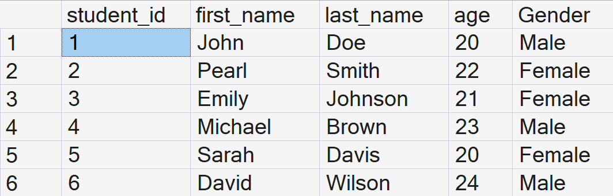
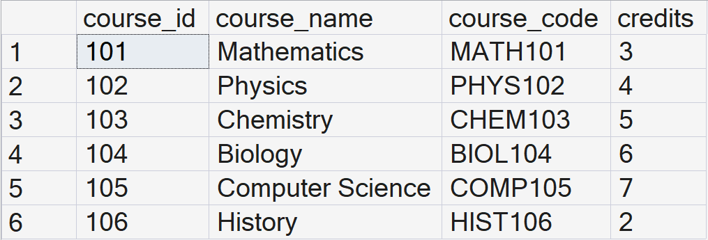
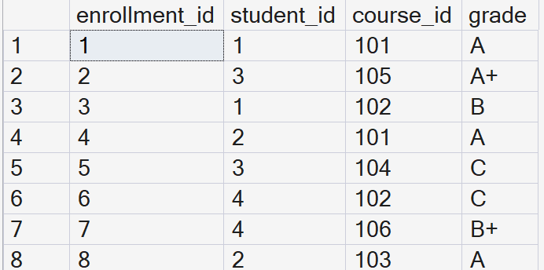
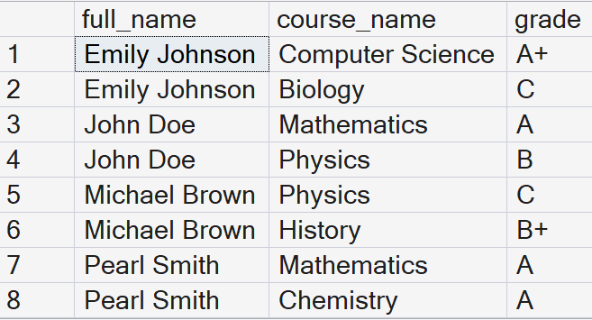
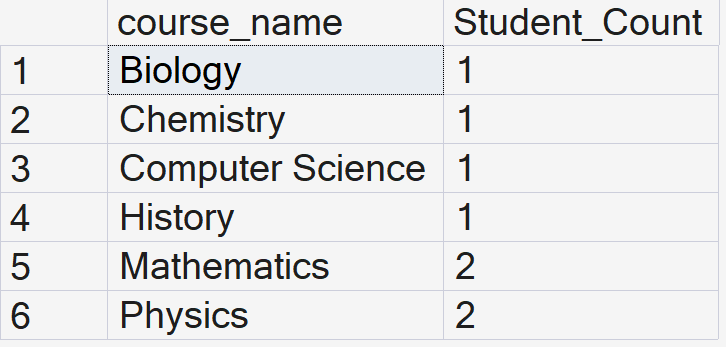
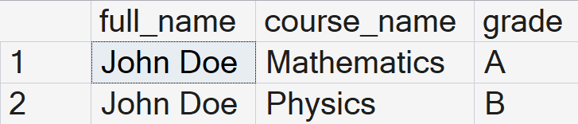

# Student Performance Analysis Database

## Project Overview
This project is a SQL-based student management and analysis system designed to demonstrate relational database concepts, data management, and analytical querying techniques.

The database stores information about:
- Students
- Courses
- Enrollments
- Student grades

The project also includes analytical queries that generate insights from the stored data.

---

## Objectives
The objectives of this project were to:
- Practice database creation and table relationships
- Apply SQL querying skills
- Perform data analysis using SQL
- Understand joins, grouping, filtering, and aggregation
- Build a beginner portfolio project for GitHub

---

## Database Structure

### 1. Students Table
Stores student information such as:
- Student ID
- First name
- Last name
- Gender
- Age

### 2. Courses Table
Stores course information such as:
- Course ID
- Course name
- Course code
- Credits

### 3. Enrollments Table
Stores student enrollments and grades.
This table connects students and courses using foreign keys.

---

## Relationships
The database uses relational design principles:
- One student can enroll in multiple courses
- One course can have multiple students
- The Enrollments table acts as a bridge between Students and Courses

---

## SQL Concepts Demonstrated
This project demonstrates:
- CREATE DATABASE
- CREATE TABLE
- PRIMARY KEYS
- FOREIGN KEYS
- INSERT statements
- UPDATE statements
- DELETE statements
- SELECT queries
- Filtering using WHERE
- Sorting using ORDER BY
- Aggregate functions
- GROUP BY
- INNER JOIN
- LEFT JOIN
- Stored Procedures
- NULL handling using COALESCE

---

## Example Analysis Queries
Some of the analytical tasks performed include:
- Displaying student enrollments
- Finding students enrolled in high-credit courses
- Counting enrollments per course
- Retrieving students without enrollments
- Finding top-credit courses
- Calculating total courses per student
- Retrieving course and grade information using stored procedures

---

## Screenshots

### Students Table

---

### Courses Table

---
### Enrollments Table

---

### Student Course Join Query

---

### Course Enrollment Count Query

---

### Stored Procedure Result

---

## Files Included

| File Name | Description |
|---|---|
| create_tables.sql | Creates the database and tables |
| insert_data.sql | Inserts sample data into the tables |
| analysis_queries.sql | Contains analytical and reporting queries |
| README.md | Project documentation |

---

## Technologies Used
- Microsoft SQL Server
- SQL
- Visual Studio Code
- GitHub

---

## Learning Outcomes
Through this project, I improved my understanding of:
- Relational database design
- SQL querying
- Data analysis concepts
- Database relationships
- Organizing technical projects using GitHub

---

## Author
Created as part of my SQL and data analytics learning journey.